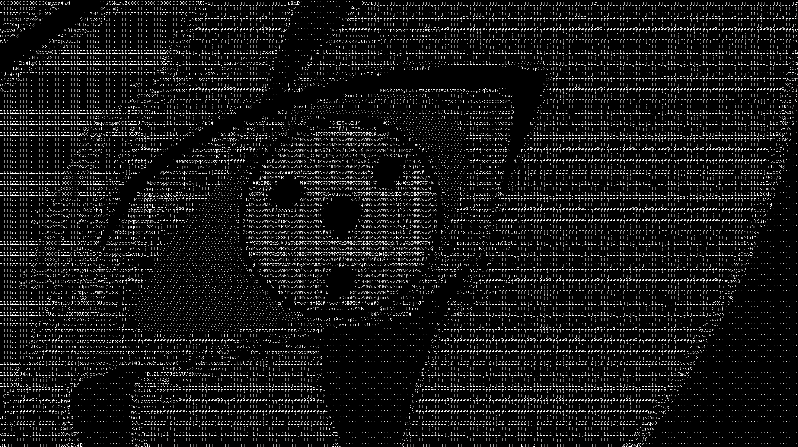

# ASCII_ART

Convert images and GIFs into ASCII art using Python and Pillow.

## How it works
Each pixel's brightness (0-255) is mapped to an ASCII character. 
Dense characters like `@` represent bright pixels, sparse characters 
like `.` represent dark pixels. The result is rendered onto a black 
canvas using a monospace font and saved as PNG or GIF.

## Supported formats
- Input: `.jpg`, `.png`, `.gif`
- Output: `.png` for images, `.gif` for animations

## Installation
```bash
pip install pillow
```

## Usage
Edit the path in `main.py` and run:
```bash
python main.py
```

## Color modes
- `color="gs"` — grayscale, white characters on black canvas
- `color="rgb"` — colored characters matching the source image pixels
  
## Sample outputs

### Flower - Grayscale (PNG)


### Flower - Color (PNG)


### Sharingan - Grayscale (GIF)


### Sharingan - Color (GIF)

